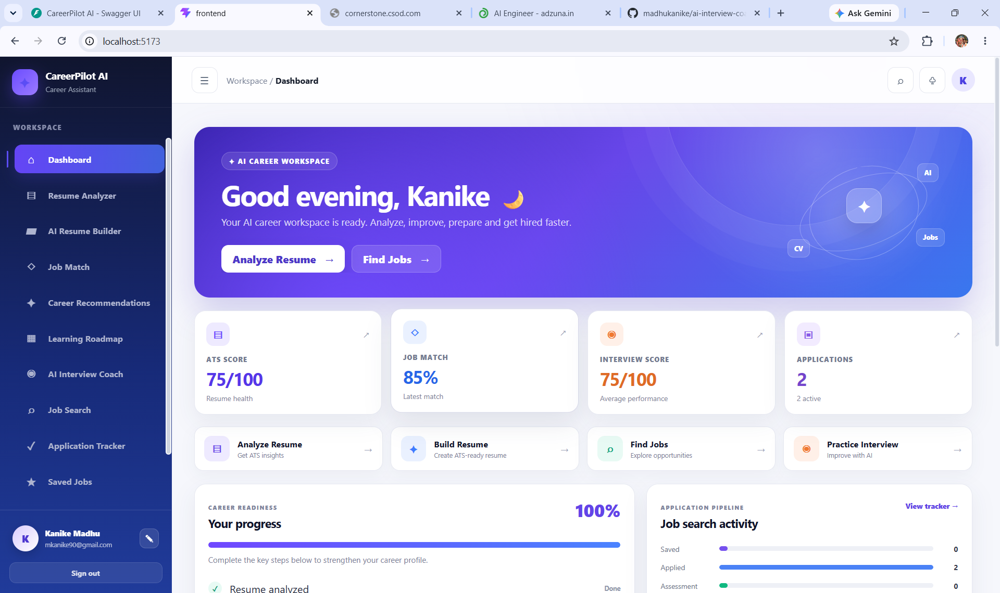

<<<<<<< HEAD
<div align="center">


# 🧭 CareerPilot AI

### A full-stack AI career workspace that analyzes your resume, matches you to real jobs, builds an ATS-ready resume, coaches your interviews and plans your learning path, all in one place.

<br/>

[](https://python.org)
[](https://fastapi.tiangolo.com)
[](https://react.dev)
[](https://vitejs.dev)
[](https://groq.com)
[](https://sqlite.org)

<br/>

**[🌐 Live Demo](#live-demo)** &nbsp;|&nbsp; **[📹 Demo Video](#)** &nbsp;|&nbsp; **[🐛 Report Bug](https://github.com/madhukanike/careerpilot-ai/issues)** &nbsp;|&nbsp; **[💼 LinkedIn](https://linkedin.com/in/madhukanike)**

<br/>



<br/>

</div>

---

## 🚀 The Problem This Solves

Job seekers juggle five or six separate tools: one for resume checking, one for job boards, one for interview practice, a spreadsheet to track applications, and random YouTube playlists for learning. None of them talk to each other, and none of them know **your** resume.

**CareerPilot AI fixes this.** Upload your resume once, and every tool in the workspace uses it: it scores your resume, matches it to any job description, finds live openings, generates an ATS-ready resume, runs a personalized mock interview, and builds a stage-by-stage learning roadmap for your target role.

---

## ✨ Features

<table>
<tr>
<td width="50%">

### 📊 Resume Analyzer
- Upload **PDF, DOCX or TXT** resumes
- AI resume score (0–100)
- Extracted skills, strengths and weaknesses
- Missing skills for your target role
- Clear improvement suggestions

</td>
<td width="50%">

### 🎯 Job Match
- Paste any job description
- Match percentage against your resume
- Matching vs missing skills
- Experience gaps and interview readiness
- Specific recommendations to close the gap

</td>
</tr>
<tr>
<td width="50%">

### 🔎 Live Job Search
- Real listings through the **Adzuna API**
- Search by keyword and location
- Save jobs, track them, or send a listing straight to Job Match
- Salary and apply links included

</td>
<td width="50%">

### 📋 Application Tracker
- Move every application through a pipeline: **Saved → Applied → Assessment → Interview → Selected / Rejected**
- Notes on each application
- Dashboard pipeline chart updates live

</td>
</tr>
<tr>
<td width="50%">

### 🎤 AI Interview Coach
- Questions generated from **your** resume and target role
- Multiple modes and difficulty levels
- Score out of 10 for every answer
- Strengths, improvements and a sample answer
- Final report with readiness and topics to revise

</td>
<td width="50%">

### 📄 AI Resume Builder
- Generates an **ATS-friendly** resume from your profile
- Outputs LaTeX source
- One-click **PDF export** (via `pdflatex`)
- Clean, recruiter-friendly layout

</td>
</tr>
<tr>
<td width="50%">

### 💡 Career Recommendations
- Current strengths with evidence
- Skills to learn, ranked by priority
- Project ideas to build your portfolio
- Interview focus areas and next steps

</td>
<td width="50%">

### 🗺️ Learning Roadmap
- Stage-by-stage plan for your target role
- Topics, estimated time and practice project per stage
- Weekly action plan and final milestone

</td>
</tr>
</table>

### 🔐 Accounts and Sync
Secure signup and login with token-based sessions. Your resume, analysis, applications, saved jobs and interview history are saved to your account and restored on every login.

---

## 🖼️ Screenshots

| Dashboard |
|:---:|
|  |
| Dashboard |
|:---:|
|  |

> Add more screenshots to `docs/screenshots/` (resume analyzer, job match, interview coach, tracker) and list them here.

---

## 🛠️ Tech Stack

```
┌──────────────────────────────────────────────────────────────┐
│                       CAREERPILOT AI                          │
├─────────────────┬────────────────────────────────────────────┤
│ AI / LLM        │ Groq API · openai/gpt-oss-20b              │
│ Backend         │ Python 3.10+ · FastAPI · Uvicorn · Pydantic│
│ Resume Parsing  │ pypdf · PyMuPDF · python-docx              │
│ Job Data        │ Adzuna Jobs API · httpx                    │
│ Resume Export   │ LaTeX · pdflatex                           │
│ Database        │ SQLite                                     │
│ Auth            │ Bearer-token sessions                      │
│ Frontend        │ React 19 · Vite · CSS                      │
└─────────────────┴────────────────────────────────────────────┘
```

---

## 📁 Project Structure

```
careerpilot-ai/
=======
CareerPilot-AI/
>>>>>>> c20a3d4746f066c5c96af52c3cc8e396324d6dac
│
├── 📁 backend/
│   ├── 📄 requirements.txt
│   ├── ⚙️ .env.example
│   └── 📁 app/
│       ├── 🚀 main.py                  # FastAPI app, CORS, router registration
│       ├── 🔐 auth.py                  # Token + password helpers
│       ├── 🗃️ db.py                    # SQLite connection and tables
│       ├── ⚙️ config.py                # Settings
│       ├── 📁 agents/
│       │   └── 🤖 career_agent.py      # Groq prompts: resume, match, interview, roadmap
│       ├── 📁 api/
│       │   ├── auth.py                 # Signup, login, me, state sync, logout
│       │   ├── resume.py               # Upload + parse + analyze
│       │   ├── job_match.py            # Resume vs job description
│       │   ├── job_search.py           # Adzuna live job search
│       │   ├── interview.py            # Basic interview endpoints
│       │   ├── advanced_interview.py   # Questions, evaluation, final report
│       │   ├── career_recommendations.py
│       │   ├── learning_roadmap.py
│       │   └── resume_builder.py       # ATS resume (LaTeX) + PDF
│       └── 📁 services/                # Resume, matching and job helpers
│
├── 📁 frontend/
│   ├── 📄 index.html
│   ├── 📄 package.json
│   └── 📁 src/
│       ├── ⚡ App.jsx                  # Application UI
│       ├── 🎨 index.css                # Design system
│       └── main.jsx
│
├── 📁 docs/screenshots/                # README images
└── 📖 README.md
```

---

## 🔌 API Reference

Interactive docs are available at **http://127.0.0.1:8000/docs** (Swagger UI).

| Method | Endpoint | Description |
|--------|----------|-------------|
| `POST` | `/auth/signup` | Create an account |
| `POST` | `/auth/login` | Log in and receive a token |
| `GET` | `/auth/me` | Current user |
| `GET` / `PUT` | `/auth/state` | Load / save the user's workspace data |
| `POST` | `/auth/logout` | End the session |
| `POST` | `/resume/upload` | Upload a resume (PDF/DOCX/TXT) → parsed text + AI analysis |
| `POST` | `/jobs/analyze` | Resume + job description → match analysis |
| `GET` | `/jobs/search` | Live job listings (Adzuna) |
| `POST` | `/advanced-interview/questions` | Generate personalized interview questions |
| `POST` | `/advanced-interview/evaluate-answer` | Score and give feedback on one answer |
| `POST` | `/advanced-interview/final-report` | Full interview performance report |
| `POST` | `/career/recommendations` | Strengths, skills to learn, project ideas |
| `POST` | `/learning/roadmap` | Stage-by-stage learning plan |
| `POST` | `/resume-builder/generate` | Generate an ATS-ready resume (LaTeX) |
| `POST` | `/resume-builder/pdf` | Compile the resume to PDF |

---

## ⚡ Quick Start

### Prerequisites
- Python 3.10+ and Node.js 18+
- Free **Groq API key**: [console.groq.com](https://console.groq.com)
- Free **Adzuna API credentials** (for job search): [developer.adzuna.com](https://developer.adzuna.com)
- *Optional:* a LaTeX distribution with `pdflatex` (only for the Resume Builder PDF export)

### 1. Clone

```bash
git clone https://github.com/madhukanike/careerpilot-ai.git
cd careerpilot-ai
```

### 2. Backend

```powershell
cd backend
python -m venv .venv
.\.venv\Scripts\Activate.ps1        # Windows
# source .venv/bin/activate         # Linux / Mac
python -m pip install -r requirements.txt
copy .env.example .env              # then add your keys (see below)
uvicorn app.main:app --reload
```

Create `backend/.env`:

```env
GROQ_API_KEY=your_groq_key
ADZUNA_APP_ID=your_adzuna_app_id
ADZUNA_APP_KEY=your_adzuna_app_key
ADZUNA_COUNTRY=in
```

Backend runs at **http://127.0.0.1:8000** and API docs at **/docs**.

### 3. Frontend

```bash
cd frontend
npm install
npm run dev
```

Open **http://localhost:5173**.

---

## 📖 How to Use

```
Step 1 → Sign up and log in
Step 2 → Resume Analyzer     → upload your resume, get score + skill gaps
Step 3 → Job Match           → paste a job description, see your fit
Step 4 → Job Search          → find live openings and track them
Step 5 → Interview Coach     → practice questions, get scored feedback
Step 6 → Career Plan         → recommendations + learning roadmap
Step 7 → Resume Builder      → generate an ATS-ready resume and export PDF
Step 8 → Dashboard           → watch your progress and pipeline grow
```

---

## 🆚 How It Compares

| Feature | Separate Tools | CareerPilot AI |
|---------|:---:|:---:|
| One resume used everywhere | ❌ | ✅ |
| AI resume analysis | ⚠️ | ✅ |
| Job match with skill gaps | ⚠️ | ✅ |
| Live job search + tracker | ❌ | ✅ |
| Personalized AI interview | ❌ | ✅ |
| ATS resume builder + PDF | ⚠️ | ✅ |
| Learning roadmap | ❌ | ✅ |
| Data saved to your account | ⚠️ | ✅ |
| Free and open source | ⚠️ | ✅ |

---

## 💡 Skills Demonstrated

| Category | Skills |
|----------|--------|
| **LLM Integration** | Groq API, prompt engineering, strict JSON outputs, AI agent design |
| **Backend** | FastAPI, Pydantic validation, REST design, token auth, SQLite |
| **Document Processing** | PDF / DOCX parsing, LaTeX generation, PDF compilation |
| **Frontend** | React 19, Vite, state management, responsive UI, debounced cloud sync |
| **Integrations** | Adzuna Jobs API, async HTTP with httpx, error handling |

---

## 🗺️ Roadmap

- [x] User authentication (signup / login / sessions)
- [x] Resume upload and AI analysis
- [x] Job description matching
- [x] Live job search and application tracker
- [x] AI interview coach with scored feedback
- [x] Career recommendations and learning roadmap
- [x] ATS resume builder with PDF export
- [ ] Docker setup for one-command run
- [ ] Automated tests (backend + frontend)
- [ ] Cloud deployment (Render / Vercel)
- [ ] Voice answers in the interview coach
- [ ] Company-specific interview packs
- [ ] Mobile app

---

## 👨‍💻 About the Developer

<table>
<tr>
<td>

**Kanike Madhu**
B.Tech CSE (AI & ML), 2025 Graduate
Nalla Narasimha Reddy Engineering College, Hyderabad

I built CareerPilot AI to solve a problem I faced in my own job search: too many disconnected tools that knew nothing about my resume or the role I wanted.

**Open to:** AI Engineer · GenAI Engineer · ML Engineer · Software Engineer roles

</td>
</tr>
</table>

📧 mkanike90@gmail.com
💼 [linkedin.com/in/madhukanike](https://linkedin.com/in/madhukanike)
🐙 [github.com/madhukanike](https://github.com/madhukanike)

---

## ⭐ Support

If this project helped you or impressed you, **give it a star!** It helps other developers find it.

---

<div align="center">

**Built with Python · FastAPI · React · Groq AI · SQLite**

*Your career, planned by AI, one resume at a time.*

<<<<<<< HEAD
</div>
=======
AI Engineer | Software Engineer

🎓 B.Tech — Computer Science & Engineering (AI & ML)

🔗 LinkedIn:
https://linkedin.com/in/madhukanike77

🔗 GitHub:
https://github.com/madhukanike

🌐 Portfolio:
https://kanikemadhu-portfolio.vercel.app

📧 Email:
mkanike90@gmail.com

⭐ CareerPilot AI

If you find this project useful or interesting, consider giving the
repository a ⭐ on GitHub.

📄 License

This project is currently maintained as a personal portfolio and
learning project.
>>>>>>> c20a3d4746f066c5c96af52c3cc8e396324d6dac
