CareerPilot-AI/
│
├── docs/
│   └── screenshots/
│       ├── 01-dashboard.png
│       ├── 02-resume-analyzer.png
│       ├── 03-ai-resume-builder.png
│       ├── 04-job-match.png
│       ├── 05-career-recommendations.png
│       ├── 06-learning-roadmap.png
│       ├── 07-ai-interview.png
│       ├── 08-interview-evaluation.png
│       ├── 09-job-search.png
│       ├── 10-application-tracker.png
│       ├── 11-saved-jobs.png
│       └── 12-profile.png
1. 🏠 Dashboard

Open Dashboard and take a screenshot showing:

Sidebar
ATS Score
Job Match
Interview Score
Applications
Quick Actions
Career Readiness
Application Pipeline

Filename:

01-dashboard.png
2. 📄 Resume Analyzer

Show:

Resume upload
Resume analysis
ATS score
Skills
Strengths
Missing skills
Recommendations

Filename:

02-resume-analyzer.png
3. 🤖 AI Resume Builder

Show:

Target Job Role
Job Description field
Generate button
Generated professional summary
Skills
ATS keywords / keyword coverage

Filename:

03-ai-resume-builder.png
4. 🎯 Job Match

Show a completed job-match result containing:

Match percentage
Matching skills
Missing skills
Experience match/gaps
Recommendations
Interview readiness

Filename:

04-job-match.png
5. 🧭 Career Recommendations

Show the generated career recommendations.

Ideally the screenshot should contain:

Recommended roles
Reasoning/explanation
Skills
Career direction

Filename:

05-career-recommendations.png
6. 🗺️ Learning Roadmap

Show:

Target role
Generated roadmap
Progress
Topics/skills
Learning stages

Filename:

06-learning-roadmap.png
7. 🎤 AI Interview Coach — Interview Screen

This one is important.

Show:

AI interviewer
Current question
Camera preview
Microphone status
Speak Answer
Read Question
Interview progress/question number

Filename:

07-ai-interview.png

Important: If your face appears in the screenshot, that's okay for your own GitHub project. If you don't want your face public, turn the camera off or use a blurred/empty camera area.

8. 📊 AI Interview — Final Evaluation

Complete an interview and show the final report.

Capture:

Overall score
Summary
Strengths
Improvements
Recommendations
Question-by-question evaluation if visible

Filename:

08-interview-evaluation.png
9. 🔎 Job Search

Show:

Search keyword
Location
Job listings
Company
Job title
Apply/View & Apply buttons
Filters if visible

Filename:

09-job-search.png
10. 📋 Application Tracker

Show applications in different stages, for example:

Applied → Screening → Interview → Offer

Take a screenshot with several applications if possible.

Filename:

10-application-tracker.png
11. ⭐ Saved Jobs

Show your saved jobs.

Filename:

11-saved-jobs.png
12. 👤 Profile

Show:

User profile
Personal information
Career information
Skills/preferences if available

Filename:

12-profile.png
⭐ Most important screenshots

If taking 12 screenshots is too much, take these 8 first:

Priority	Screenshot
⭐⭐⭐⭐⭐	Dashboard
⭐⭐⭐⭐⭐	Resume Analyzer
⭐⭐⭐⭐⭐	AI Resume Builder
⭐⭐⭐⭐⭐	Job Match
⭐⭐⭐⭐⭐	AI Interview
⭐⭐⭐⭐⭐	Interview Evaluation
⭐⭐⭐⭐	Job Search
⭐⭐⭐⭐	Application Tracker

These are enough to make the README look professional.

📁 Where exactly to put them

Inside your project root:

CareerPilot-AI
│
├── backend
├── frontend
├── docs
│   └── screenshots
│       ├── 01-dashboard.png
│       ├── 02-resume-analyzer.png
│       ├── 03-ai-resume-builder.png
│       ├── 04-job-match.png
│       ├── 05-career-recommendations.png
│       ├── 06-learning-roadmap.png
│       ├── 07-ai-interview.png
│       ├── 08-interview-evaluation.png
│       ├── 09-job-search.png
│       ├── 10-application-tracker.png
│       ├── 11-saved-jobs.png
│       └── 12-profile.png
│
├── README.md
└── .gitignore

Do not put the screenshots inside frontend/src/.

📐 Screenshot quality

For GitHub, try to capture the entire application window, preferably around:

1920 × 1080 or 1600 × 900

Don't crop too tightly. We want the GitHub visitor to understand the application UI.

Also:

Close unnecessary browser tabs/windows.
Use realistic but non-sensitive sample data.
Don't show your Groq API key.
Don't show .env.
Don't show passwords or private tokens.
For Job Search, use a few realistic results.
For Resume Analyzer/Job Match, use your sample resume data.
🎨 One important thing

You do not need to create diagrams yourself.

For the README, I can create the Mermaid architecture diagrams and workflow diagrams as Markdown code.

You only need to provide the actual application screenshots.

So your work now is simply:

1. Open CareerPilot AI → 2. Take screenshots → 3. Create docs/screenshots → 4. Put the screenshots there.

After you've placed them, tell me “screenshots placed” and I'll give you the complete professional README.md code, with all 12 screenshots properly embedded, diagrams, feature sections, architecture, setup, API documentation, and deployment sections.

ok done i placeit on project folder also

Perfect 👍. Now we can build the README around the actual screenshots you placed, rather than using placeholders.

Your project should now look like this
CareerPilot-AI/
│
├── backend/
├── frontend/
├── docs/
│   └── screenshots/
│       ├── 01-dashboard.png
│       ├── 02-resume-analyzer.png
│       ├── 03-ai-resume-builder.png
│       ├── 04-job-match.png
│       ├── 05-career-recommendations.png
│       ├── 06-learning-roadmap.png
│       ├── 07-ai-interview.png
│       ├── 08-interview-evaluation.png
│       ├── 09-job-search.png
│       ├── 10-application-tracker.png
│       ├── 11-saved-jobs.png
│       └── 12-profile.png
│
├── README.md
└── .gitignore

Your current CareerPilot AI frontend includes these major areas, including Resume Analyzer, AI Resume Builder, Job Match, Career Recommendations, Learning Roadmap, AI Interview Coach, Job Search, Application Tracker, Saved Jobs, History, and Profile.

One important thing before I give you the final README

Don't manually write the README yet.

I can prepare the complete professional README.md for you with:

🏠 Project overview
📸 Your actual screenshots
✨ Feature table
🏗️ System architecture diagram
🔄 AI career workflow diagram
📄 Resume analysis workflow
🎯 Job matching workflow
🎤 Interview workflow
🔎 Job search workflow
🗺️ Learning roadmap
🧠 AI/LLM architecture
🛠️ Tech stack table
📁 Project structure
⚙️ Installation
🔐 Environment variables
🔌 API endpoints
🖥️ Screenshots gallery
🚀 Deployment
🔮 Future improvements
👨‍💻 Author section
Live Demo: Coming Soon until you deploy it

And the README will reference your screenshots like:

## 📸 Application Screenshots

### 🏠 Dashboard

### 📄 Resume Analyzer

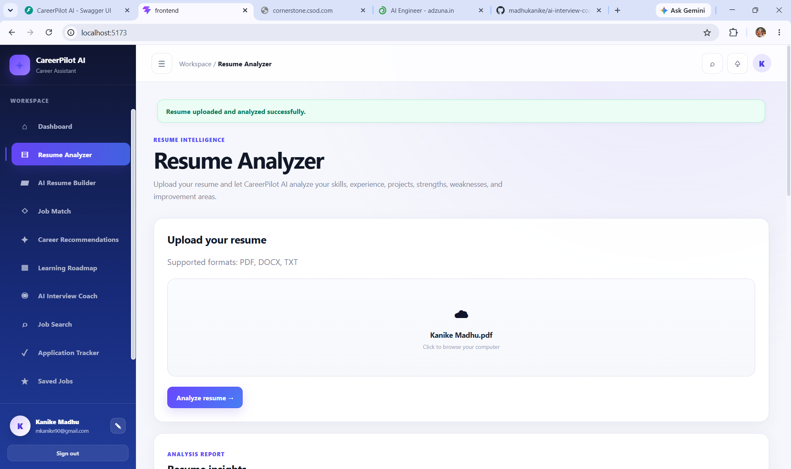

So when you push to GitHub, the actual images will appear, not just the Markdown text.

The previous short code you saw was only an example. The final README will be a substantially larger, complete GitHub README.

Next step: I'll prepare the complete README.md based on your actual CareerPilot AI features and the screenshot filenames you created.

prepare you can see in ss

Done. I prepared the complete professional README.md based on your CareerPilot AI project and the screenshot names you showed.

📥 Download the README

Download README_CareerPilot_AI.md

What is included
🏠 Dashboard screenshot
📄 Resume Analyzer screenshot
🤖 AI Resume Builder screenshot
🎯 Job Match screenshot
🧭 Career Recommendations screenshot
🗺️ Learning Roadmap screenshot
🎤 AI Interview screenshots
📊 Interview Evaluation screenshot
🔎 Job Search screenshot
📋 Application Tracker screenshot
🕘 History screenshot
👤 Profile screenshot
Mermaid architecture diagrams
Career workflow diagrams
Interview sequence diagram
Technology stack
Project structure
Installation instructions
Environment variables
API modules
Security / .gitignore
Deployment architecture
Future improvements
Author section
Live Demo: Coming Soon
⚠️ One thing I noticed from your screenshot

Your actual screenshot folder has:

07-ai-interview.png
08 AI Interview.png
09-interview-evaluation.png
10-job-search.png
11-application-tracker.png
12-History.png
13-Profile.png

So I used those names in the README. Do not rename them unless necessary.

Now replace your existing:

CareerPilot-AI/README.md

with the downloaded file.

Then open the README in VS Code. After that, we can do the final GitHub check before you push — especially checking .gitignore, .env, venv, node_modules, screenshots, and README image paths. 

README_CareerPilot_AI.md
Document

Library
/
README_CareerPilot_AI.md
🚀 CareerPilot AI

An AI-powered career workspace for resume analysis, ATS
optimization, job matching, interview preparation, live job search,
application tracking, and personalized career development.

CareerPilot AI brings the major stages of the job-search journey into
one full-stack application.

📸 Product Screenshots
🏠 Dashboard

<figure>  <figcaption aria-hidden="true">CareerPilot AI Dashboard</figcaption> </figure>

📄 Resume Analyzer

<figure>  <figcaption aria-hidden="true">Resume Analyzer</figcaption> </figure>

🤖 AI Resume Builder

<figure> 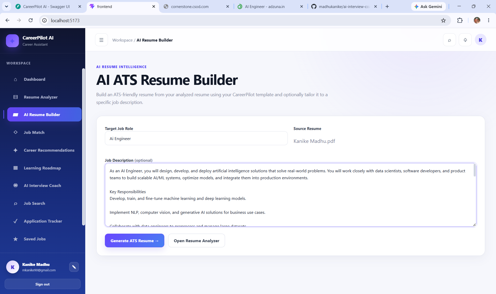 <figcaption aria-hidden="true">AI Resume Builder</figcaption> </figure>

🎯 Job Match

<figure> 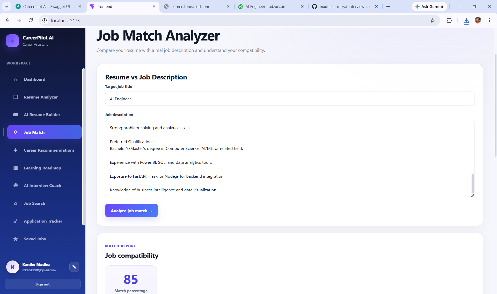 <figcaption aria-hidden="true">Job Match</figcaption> </figure>

🧭 Career Recommendations

<figure> 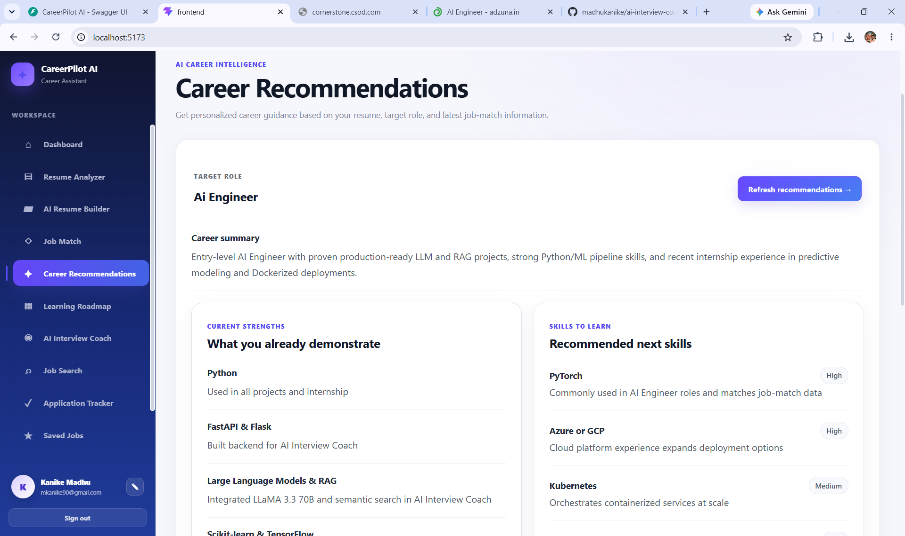 <figcaption aria-hidden="true">Career Recommendations</figcaption> </figure>

🗺️ Learning Roadmap

<figure> 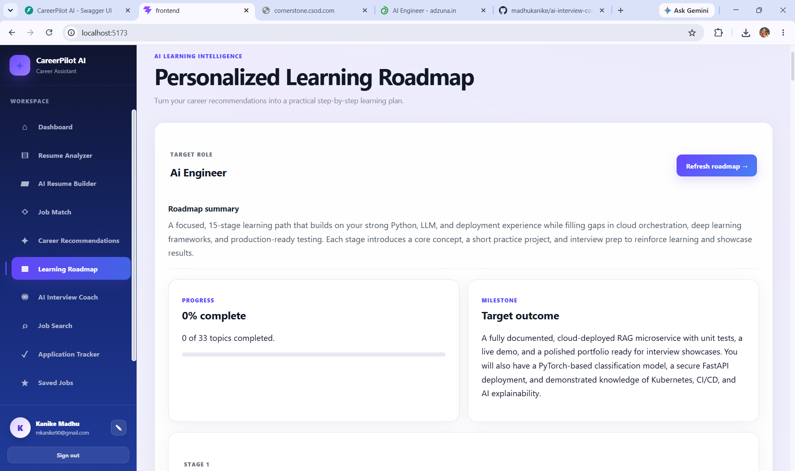 <figcaption aria-hidden="true">Learning Roadmap</figcaption> </figure>

🎤 AI Interview Coach

<figure> 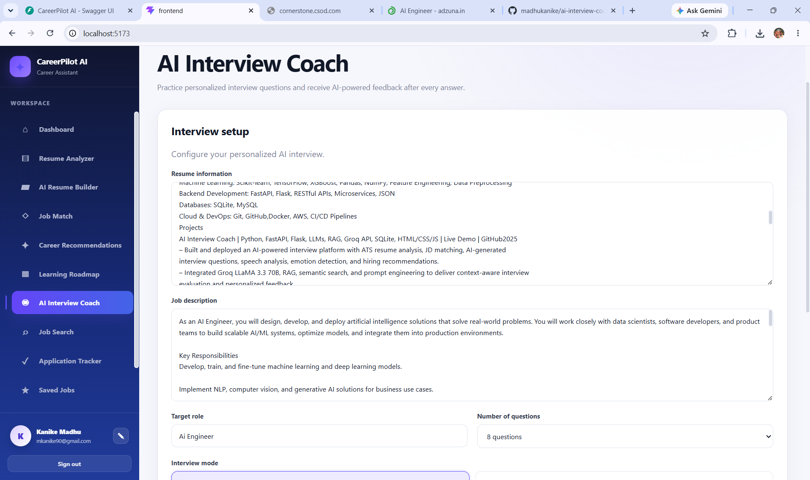 <figcaption aria-hidden="true">AI Interview Coach</figcaption> </figure>

🎤 Interview Workspace

<figure>  <figcaption aria-hidden="true">Interview Workspace</figcaption> </figure>

📊 Interview Evaluation

<figure> 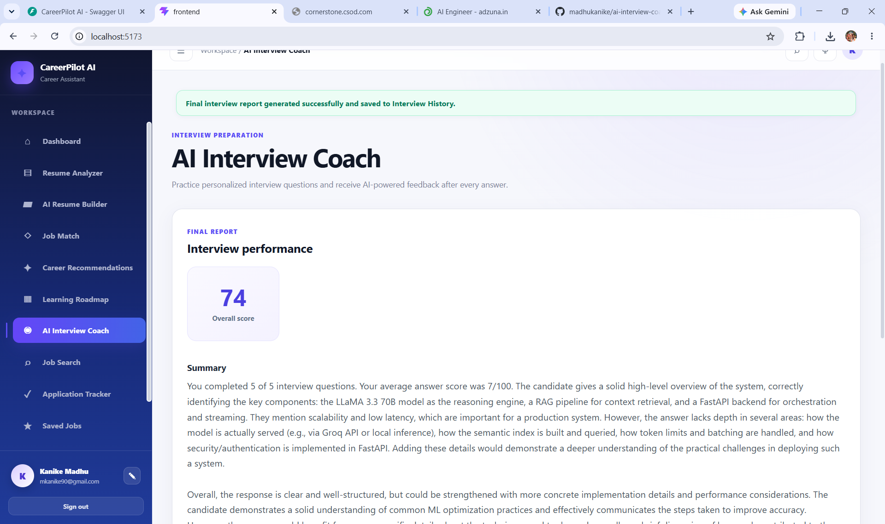 <figcaption aria-hidden="true">Interview Evaluation</figcaption> </figure>

🔎 Job Search

<figure> 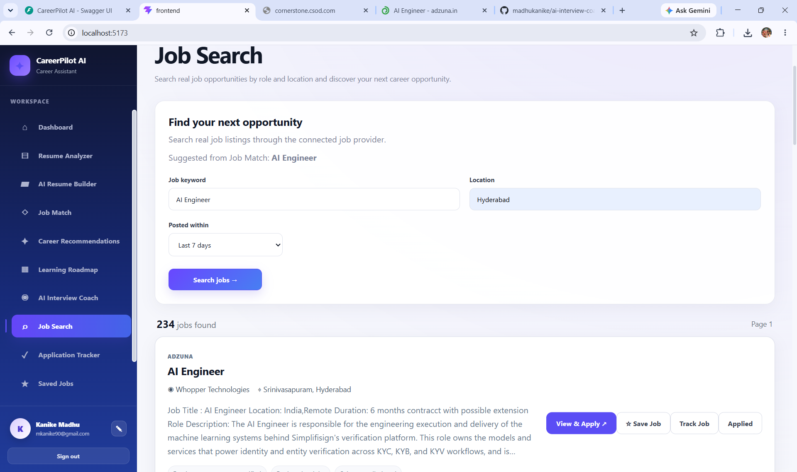 <figcaption aria-hidden="true">Job Search</figcaption> </figure>

📋 Application Tracker

<figure> 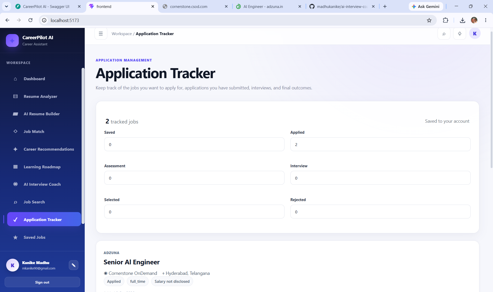 <figcaption aria-hidden="true">Application Tracker</figcaption> </figure>

🕘 History

<figure> 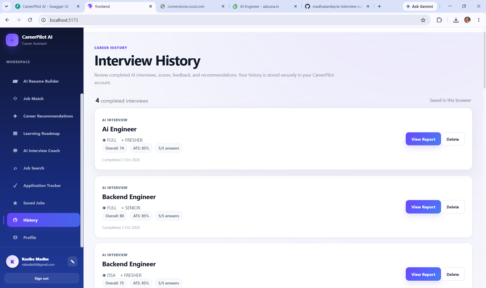 <figcaption aria-hidden="true">History</figcaption> </figure>

👤 Profile

<figure> 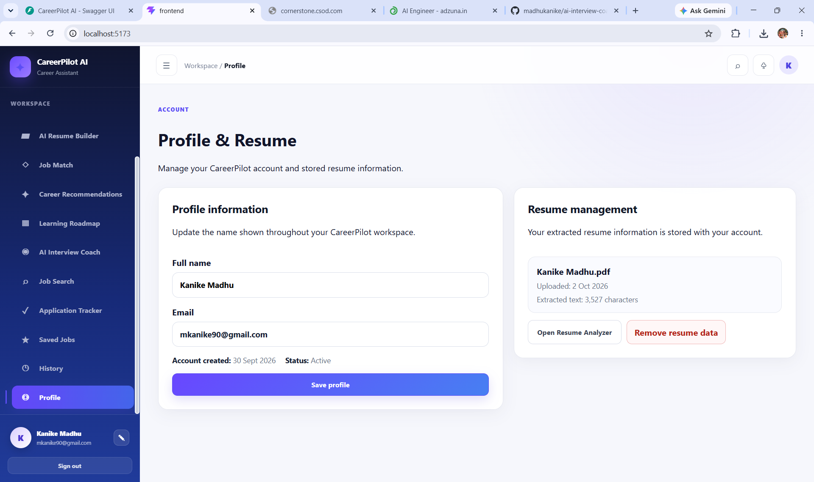 <figcaption aria-hidden="true">Profile</figcaption> </figure>

✨ Features
Module	Description
📄 Resume Analyzer	Upload and analyze resumes with ATS-oriented insights
🤖 AI Resume Builder	Generate role-focused resume content from existing resume information
🎯 Job Match	Compare a resume with a target job and identify matching/missing skills
🧭 Career Recommendations	Generate personalized career direction, skills, projects, and next steps
🗺️ Learning Roadmap	Build role-focused learning topics and track progress
🎤 AI Interview Coach	Generate questions, evaluate answers, support camera/microphone, and create reports
🔎 Job Search	Search live opportunities using keyword and location filters
⭐ Saved Jobs	Save interesting opportunities for later
📋 Application Tracker	Track applications and their progress
🕘 History	Review previous career/interview activity
👤 Profile	Manage career profile information
🧠 CareerPilot AI Workflow
flowchart LR
    A[👤 Candidate] --> B[📄 Resume]
    B --> C[🔍 Resume Analysis]
    C --> D[🎯 Job Match]
    C --> E[🤖 Resume Builder]
    C --> F[🧭 Career Recommendations]
    F --> G[🗺️ Learning Roadmap]
    D --> H[🔎 Job Search]
    H --> I[⭐ Saved Jobs]
    H --> J[📋 Application Tracker]
    C --> K[🎤 AI Interview]
    K --> L[📊 Evaluation]
🏗️ System Architecture
flowchart TB
    USER[👤 User]

    subgraph FRONTEND[Frontend]
        REACT[React + Vite]
        UI[CareerPilot AI Workspace]
    end

    subgraph BACKEND[FastAPI Backend]
        AUTH[Authentication]
        RESUME[Resume API]
        MATCH[Job Match API]
        INTERVIEW[Interview API]
        CAREER[Career API]
        ROADMAP[Learning API]
        JOBS[Job Search API]
        BUILDER[Resume Builder API]
    end

    subgraph AI[AI Layer]
        AGENT[Career Agent]
        GROQ[Groq LLM]
    end

    subgraph DATA[Data / External Services]
        SQLITE[(SQLite)]
        ADZUNA[Adzuna API]
    end

    USER --> REACT
    REACT --> UI
    UI --> AUTH
    UI --> RESUME
    UI --> MATCH
    UI --> INTERVIEW
    UI --> CAREER
    UI --> ROADMAP
    UI --> JOBS
    UI --> BUILDER

    RESUME --> AGENT
    MATCH --> AGENT
    INTERVIEW --> AGENT
    CAREER --> AGENT
    ROADMAP --> AGENT
    BUILDER --> AGENT

    AGENT --> GROQ
    AUTH --> SQLITE
    RESUME --> SQLITE
    INTERVIEW --> SQLITE
    JOBS --> ADZUNA
🔄 Core Modules
1. 📄 Resume Analyzer

The Resume Analyzer accepts a resume and processes its content for
AI-assisted analysis.

Resume Upload
     ↓
Text Extraction
     ↓
Resume Analysis
     ↓
ATS-Oriented Insights
     ↓
Skills / Strengths / Gaps
     ↓
Improvement Recommendations

Supported upload types include PDF, DOCX, and TXT.

2. 🤖 AI Resume Builder

The AI Resume Builder accepts a target job role and can optionally use a
job description to tailor the generated resume content.

flowchart LR
    A[Existing Resume] --> D[CareerPilot AI]
    B[Target Role] --> D
    C[Job Description] --> D
    D --> E[ATS Keywords]
    D --> F[Professional Summary]
    D --> G[Skills]
    D --> H[Projects / Experience]
    D --> I[Resume Output]

The builder is designed around the available candidate information
rather than arbitrarily creating unsupported experience.

3. 🎯 Job Match

Job Match compares candidate information with a target job description.

It can surface:

Matching skills
Missing skills
Matching experience
Experience gaps
Recommendations
Interview readiness
Resume + Job Description
          ↓
      AI Matching
          ↓
 ┌────────┼─────────┐
 ↓        ↓         ↓
Skills  Experience  Gaps
 └────────┼─────────┘
          ↓
   Recommendations
4. 🧭 Career Recommendations

Career recommendations connect resume analysis and job matching with
practical next steps.

The recommendation workflow can include:

Current strengths
Skills to learn
Recommended projects
Interview focus areas
Next steps
5. 🗺️ Learning Roadmap

The Learning Roadmap organizes development around a target role.

Target Role
    ↓
Required Skills
    ↓
Learning Topics
    ↓
Practice / Projects
    ↓
Progress
6. 🎤 AI Interview Coach

The AI Interview Coach provides an interactive interview workflow.

Capabilities
AI-generated interview questions
Question-by-question answering
Answer evaluation
Interview progress
Camera support
Microphone support
Browser speech recognition where supported
Text-to-speech question reading
Final interview report
Interview Architecture
sequenceDiagram
    participant U as Candidate
    participant F as React
    participant B as FastAPI
    participant A as Career Agent
    participant G as Groq

    U->>F: Start Interview
    F->>B: Request Questions
    B->>A: Generate Questions
    A->>G: LLM Request
    G-->>A: Questions
    A-->>B: Interview Data
    B-->>F: Questions

    U->>F: Submit Answer
    F->>B: Evaluate Answer
    B->>A: Analyze Answer
    A->>G: Evaluation Request
    G-->>A: Evaluation
    A-->>B: Score + Feedback
    B-->>F: Feedback

    F->>B: Final Report
    B-->>F: Summary + Improvements
7. 🔎 Job Search

The Job Search module connects the application to live job data.

Users can search using parameters such as:

Keyword
Location
Maximum job age
Results per page

Job results can then be viewed and moved into the user’s
saved-job/application workflow.

8. ⭐ Saved Jobs

Interesting job opportunities can be saved and reviewed later from the
Saved Jobs section.

9. 📋 Application Tracker

The Application Tracker provides a central place to organize
applications.

Example workflow:

Saved
  ↓
Applied
  ↓
Screening / Assessment
  ↓
Interview
  ↓
Offer / Closed
10. 🕘 History

History provides access to previous career and interview-related
activity.

11. 👤 Profile

The Profile section provides a dedicated place for the user’s career
information and preferences.

🛠️ Technology Stack
Layer	Technology
Frontend	React
Build Tool	Vite
Backend	FastAPI
Language	Python
AI / LLM	Groq API
AI Agent	Career Agent
Database	SQLite
Job Search	Adzuna API
Resume Processing	Python PDF/DOCX/TXT processing
Styling	CSS
API Documentation	FastAPI Swagger / OpenAPI
Development	Cursor / VS Code
Version Control	Git + GitHub
📁 Project Structure
CareerPilot-AI/
│
├── backend/
│   ├── app/
│   │   ├── api/
│   │   │   ├── auth.py
│   │   │   ├── resume.py
│   │   │   ├── job_match.py
│   │   │   ├── interview.py
│   │   │   ├── advanced_interview.py
│   │   │   ├── job_search.py
│   │   │   ├── career_recommendations.py
│   │   │   ├── learning_roadmap.py
│   │   │   └── resume_builder.py
│   │   │
│   │   ├── services/
│   │   │   └── career_agent.py
│   │   │
│   │   └── main.py
│   │
│   ├── data/
│   │   └── careerpilot.db
│   ├── .env
│   └── requirements.txt
│
├── frontend/
│   ├── src/
│   │   ├── App.jsx
│   │   ├── App.css
│   │   ├── index.css
│   │   └── main.jsx
│   ├── package.json
│   └── vite.config.js
│
├── docs/
│   └── screenshots/
│       ├── 01-dashboard.png
│       ├── 02-resume-analyzer.png
│       ├── 03-ai-resume-builder.png
│       ├── 04-job-match.png
│       ├── 05-career-recommendations.png
│       ├── 06-learning-roadmap.png
│       ├── 07-ai-interview.png
│       ├── 08 AI Interview.png
│       ├── 09-interview-evaluation.png
│       ├── 10-job-search.png
│       ├── 11-application-tracker.png
│       ├── 12-History.png
│       └── 13-Profile.png
│
├── .gitignore
├── README.md
└── package-lock.json
⚙️ Local Installation
Prerequisites

Install:

Python 3.x
Node.js
npm
Git
Backend
cd backend
python -m venv .venv
.venv\Scripts\activate
pip install -r requirements.txt

Create:

backend/.env

Example:

GROQ_API_KEY=your_groq_api_key
ADZUNA_APP_ID=your_adzuna_app_id
ADZUNA_APP_KEY=your_adzuna_app_key

Start FastAPI:

python -m uvicorn app.main:app --reload

Backend:

http://127.0.0.1:8000

Swagger:

http://127.0.0.1:8000/docs
Frontend

Open another terminal:

cd frontend
npm install
npm run dev

Frontend:

http://localhost:5173
🔐 Environment & Security

Do not commit secrets or local runtime files.

Recommended .gitignore entries:

.env
.env.*
!.env.example

__pycache__/
*.py[cod]

.venv/
venv/
node_modules/
dist/

*.db
*.sqlite
*.sqlite3
*.log

.DS_Store
Thumbs.db

Before pushing:

git status

Make sure API keys and .env are not tracked.

🔌 API Modules
API Module	Responsibility
Authentication	Login/session functionality
Resume	Resume upload and analysis
Job Match	Resume-to-job comparison
Interview	Interview workflows
Advanced Interview	Question generation, answer evaluation, final reports
Job Search	Live job discovery
Career Recommendations	Personalized career guidance
Learning Roadmap	Role-focused learning plans
Resume Builder	AI-assisted resume generation and PDF workflow

The exact endpoints can be inspected through FastAPI Swagger at /docs.

🧪 Typical User Journey
flowchart TD
    A[Upload Resume] --> B[Analyze Resume]
    B --> C[Review ATS Insights]
    C --> D[Identify Skill Gaps]
    D --> E[Learning Roadmap]

    B --> F[Job Match]
    F --> G[Search Jobs]
    G --> H[Save Job]
    H --> I[Track Application]

    B --> J[AI Resume Builder]
    J --> I

    B --> K[AI Interview Coach]
    K --> L[Interview Evaluation]
    L --> I
🚀 Deployment Architecture
flowchart LR
    USER[👤 User]
    FRONTEND[React / Vite]
    BACKEND[FastAPI]
    AI[Groq API]
    JOBS[Adzuna API]
    DB[(Production Database)]

    USER --> FRONTEND
    FRONTEND --> BACKEND
    BACKEND --> AI
    BACKEND --> JOBS
    BACKEND --> DB
Deployment Plan
Frontend: Vercel
Backend: Python-compatible cloud platform
AI: Groq API
Jobs: Adzuna API
Database: Production database when deployed

🌐 Live Demo: Coming Soon

💡 Engineering Highlights

CareerPilot AI demonstrates practical full-stack and AI engineering
concepts:

React + FastAPI architecture
REST API integration
LLM integration
AI agent/service layer
Resume document processing
ATS-oriented resume analysis
Job matching
External job API integration
AI interview generation
AI answer evaluation
Browser camera and microphone APIs
Speech recognition and speech synthesis
SQLite persistence
Authentication/session handling
PDF resume generation
Frontend state management
Environment-based API configuration
⚠️ Limitations

AI-generated results depend on the quality of the provided resume, job
description, prompts, model responses, browser capabilities, and
external API availability.

Career guidance and interview feedback are intended as assistance and
should not be treated as guarantees of hiring outcomes.

🔮 Future Improvements

Possible future development:

More interview categories
Dedicated coding/DSA interview mode
More resume templates
Additional job sources
Richer application analytics
More learning resources
Improved interview analytics
Production database
Automated CI/CD
More external career-platform integrations
👨‍💻 Author
Kanike Madhu

AI Engineer | Software Engineer

🎓 B.Tech — Computer Science & Engineering (AI & ML)

🔗 LinkedIn:
https://linkedin.com/in/madhukanike77

🔗 GitHub:
https://github.com/madhukanike

🌐 Portfolio:
https://kanikemadhu-portfolio.vercel.app

📧 Email:
mkanike90@gmail.com

⭐ CareerPilot AI

If you find this project useful or interesting, consider giving the
repository a ⭐ on GitHub.

📄 License

This project is currently maintained as a personal portfolio and
learning project.
